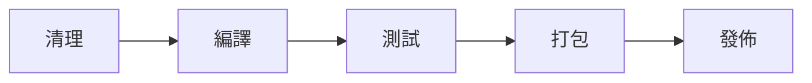
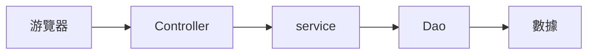
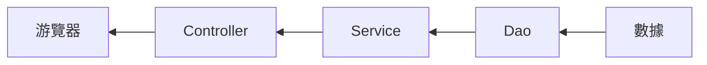
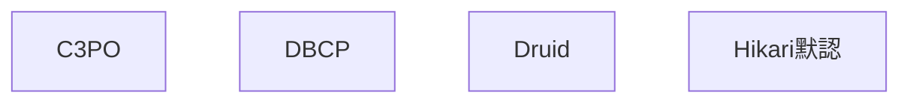

# JAVA後端學習

### Maven

apache旗下的開源項目,基於項目對象模型(POM)概念,管理和構建java項目的工具

> POM(project object model)

---

**作用**：

- **依賴管理**：方便管理項目的依賴資源(jar包)，可以避免版本衝突

- **統一項目結構**：提供標準，統一的項目結構
  
  

- **項目構建**：標準跨平臺(LINUX,WIN,MAC)的自動化項目構建方式



---


```
倉庫：用於存儲資源，管理各種jar包
    本地倉庫：自己計算機上的一個目錄
    中央倉庫：由maven團隊維護的全球唯一的。
    遠端倉庫(私服)：一般由公司團隊搭建的私有倉庫
```

---

#### 1.安裝

##### 安裝過程

1. 解壓安裝包（apache-maven-...-bin.zip）

2. 配置本地倉庫：修改conf/setting.xml中的<localRepository>為一個指定目錄
   
   ```xml
     <localRepository>C:\ProgramData\apache-maven-3.9.8-bin\apache-maven-3.9.8\mvn_repo</localRepository>
   ```

3. 配置阿里雲私服：修改conf/setting.xml中的<mirrors>標簽，為其添加子標簽：
   
   ```xml
   <mirror>
       <id>alimaven</id>
       <name>aliyun maven</name>
       <url>http://maven.aliyun.com/nexus/content/groups/public</url>
       <mirrorOf>central</mirrorOf>
   </mirror>
   ```

4. 配置環境變量：MAVEN_HOME為maven的解壓目錄，並將其bin目錄加入path環境變量

---

##### 測試

```shell
mvn -n ##查看maven的版本號
```

---

#### 2. IDEA集成Maven

##### 配置Maven環境（當前工程）

- 選擇IDEA中File --> Settings --> Build,Execution,Deployment --> Build Tools --> Maven

- 設置IDEA使用本地安裝的Maven，修改配置安裝目錄，配置文件，本地倉庫路徑

- 設置Maven下Runner内 JRE的版本

- 設置Compiler 下 java Compile 内 字節碼的版本

##### 配置Maven環境（全局環境）

- 選擇IDEA中Customize -->All Settings --> Build,Execution,Deployment -->進行同樣操作

---

##### 創建Maven項目

1. 創建模塊，選擇Maven，點擊Next

2. 填寫模塊名稱，坐標信息，點擊finish，創建完成

3. 編寫HelloWorld測試

###### Maven坐標

什麽是坐標 ？

- Maven中坐標是資源的唯一標識，通過該坐標可以唯一定位資源位置

- 使用坐標來定義項目或引入項目中需要的依賴 

Maven坐標主要組成

- groupId：Maven項目隸屬組織名稱（通常是域名反寫，例如：com.itheima1）

- artifactId：Maven項目名稱（通常是模塊名稱，例如order-service，good-service）

- version：項目版本號

```xml
  <groupId>com.itheima</groupId>
  <artifactId>maven-project01</artifactId>
  <version>1.0-SNAPSHOT</version>
```

---

##### 導入Maven項目

1. 打開IDEA，選擇右側Maven面板，點擊 + 號，選中對應項目的pom.xml，雙擊即可

2. 打開IDEA，選擇左上的File，點擊Project Structure，點擊modules，點擊 + 號 並選擇import Module，選中對應項目的pom.xml，點擊Apply及Ok

---

#### 3.依賴管理

##### 依賴配置

依賴：指當前項目運行所需要的jar包，一個項目可以引入多個依賴

配置：

1. 在pom.xml内編寫<dependencies>標簽

2. 在<>dependencies>標簽中使用<dependency>標簽

3. 定義坐標的groupId，artifactId，version

4. 點擊刷新按鈕，引入最新加入的坐標

```xml
 </dependencies>
    <dependency>
      <groupId>ch.qos.logback</groupId>
      <artifactId>logback-classic</artifactId>
      <version>1.5.6</version>
    </dependency>
  </dependencies>
```

注意事項：

- 如果引入的依賴，在本能地倉庫不存在，將會連接遠程倉庫/中央倉庫下載依賴（耗時）

- 如果不知道依賴的坐標信息，可以到 (https://mvnrepository.com/) 中搜索

---

##### 依賴傳遞

依賴具有傳遞性

- 直接依賴：在當前項目中通過依賴配置建立的依賴關係

- 間接依賴：被依賴的資源如果依賴著其他資源，當前項目間接依賴其他資源


圖表依賴查看：在pom文件當中右鍵，選擇Diagrams，選擇Show Dependencies

-   排除依賴：主動斷開依賴的資源，被排除的資源無需指定版本 

```xml
<exclusion>
          <groupId></groupId>
      <artifactId></artifactId>
</exclusion>
```

---

##### 依賴範圍

依賴的jar包，默認情況，可以在任何地方使用。可以通過<scope></scope>設置其作用範圍

- 主程序範圍有效（main文件夾範圍内）

- 測試程序範圍有效（test文件夾範圍内）

- 是否參與打包運行（package指令範圍内）

```xml
 </dependencies>
    <dependency>
      <groupId>ch.qos.logback</groupId>
      <artifactId>logback-classic</artifactId>
      <version>1.5.6</version>
      <scope>test</scope>
    </dependency>
  </dependencies>
```

| **scope值**  | **主程序** | **測試程序** | **打包（運行）** | **範例**      |
|:-----------:|:-------:|:--------:|:----------:|:-----------:|
| compile（默認） | Y       | Y        | Y          | log4j       |
| test        | -       | Y        | -          | junit       |
| provided    | Y       | Y        | -          | servlet-api |
| runtime     | -       | Y        | Y          | jdbc驅動      |

---

##### 生命周期

Maven的生命周期就是爲了對所有的maven項目構建過程進行抽象和統一

Maven有三套相互獨立的生命周期：

- clean：清理工作

- default：核心工作，如：編譯，測試，打包，安裝，部署等

- site：生成報告，發佈站點等

###### 生命周期階段

- clean：移除上一次構建生成的文件

- compile：編譯項目源代碼

- test：使用合適的單元測試框架運行測試（junit)

- package：將編譯后的文件打包，如：jar，war等

- install：安裝項目到本地倉庫

> 在同一套生命周期中，黨運行後面的階段時，前面的階段都會運行

執行指定生命周期的兩種方式：

- 在IDEA中，右側的maven工作欄，選中對應的生命周期，雙擊執行

- 在命令行中，通過命令執行
  
  ```shell
  mvn compile
  ```

---

### SpringBootWeb

官網：(https://spring.io/

**Spring**聚焦于速度，簡單，生產力，是目前全球最受歡迎的java框架

提供了若干個子項目，每個項目用於完成特定的功能：

- SpringBoot：快速方便地構建spring應用程序

- Spring Framework：Spring整個底層最基礎的框架

- Spring Data：封裝了一系列範圍數據庫的技術

- Spring Cloud：構建微服務項目

- ...

**SpringBoot**可以幫助我們非常快速的構建應用程序，簡化開發，提高效率

---

##### 快速入門

需求：使用SpringBoot開發一個web應用，游覽器發起請求/hello后，給游覽器返回字符串“Hello World ~~”

**步驟**

打開([https://start.spring.io/](https://start.spring.io/)

1. 創建SpringBoot工程，並勾選web開發相關依賴

2. 定義HelloController類，添加方法hello,並添加注解
   
   ```java
   @RestController
   public class HelloController {
       @RequestMapping("/hello")
       public String hello(){
           System.out.println("Hello World~");
           return "Hello World~";
       }
   }
   ```

3. 運行測試（xxxApplication.java内run程序）
   
   ```shell
   ##查看端口號
   netstat -ano | findstr "8080"
   
   ##殺死端口號，使用admin進入
   taskkill /PID 3984 /F
   ```

---

##### HTTP協議

概念：（Hyper Text Transfer Protocol）超文本傳輸協議，規定了游覽器和服務器之間數據傳輸的規則

特點：

1. 基於TCP協議：面向連接，安全

2. 基於請求-響應模型的：一次請求對應一次響應

3. HTTP協議是無狀態的協議：對於事務處理沒有記憶能力，每次請求-響應都是獨立的
   
   - 缺點：多次請求間不能共享數據
   
   - 優點：速度快

---

##### HTTP 請求協議

- 請求行
  
  請求數據的第一行
  
  （請求方式，資源路徑，協議）

- 請求頭
  
  第二行開始，格式key：value
  
  
  
  | Host            | 請求的主機名                                        |
  |:---------------:| --------------------------------------------- |
  | User-Agent      | 游覽器版本，例如Chrome游覽器的標識類似Mozilla/5.0...Chrome/79 |
  | Accept          | 表示游覽器能接受的資源類型，如text/*，image/...               |
  | Accept-Language | 表示游覽器偏好的語言，服務器可以據此返回不同的語言的網頁                  |
  | Accept-Encoding | 表示游覽器可以支持的壓縮類型，例如gzip,deflate等                |
  | Content-Type    | 請求主體的數據類型                                     |
  | Content-Length  | 親求主體的大小（單位：字節）                                |

- 請求體
  
  POST請求，存放請求參數
  
  **請求方式**
  
  - GET：請求參數在請求行中，沒有請求體，GET請求大小有限制
  
  - POST：請求參數在請求體中，POST請求大小無限制

---

##### HTTP響應協議

- 響應頭
  
  響應數據第一行
  
  （協議，狀態碼，描述）
  
  | 1xx | 響應中-臨時狀態碼，表示請求已經接受，告訴客戶端響應應該繼續請求或者如果它已經完成則忽略它  |
  |:---:| ---------------------------------------------- |
  | 2xx | 成功-表示請求已經被成功接收，處理已完成                           |
  | 3xx | 重定向-重定向到其他地方；讓客戶端再發一次請求以完成整個處理                 |
  | 4xx | 客戶端錯誤-處理發生錯誤，責任在客戶端。如：請求了不存在的資源，客戶端未被授權，禁止訪問等。 |
  | 5xx | 服務器錯誤-處理發生錯誤，責任在服務端。如：程序抛出異常等                  |

- 響應頭
  
  第二行開始，格式key：value
  
  | Content-Type     | 表示該響應内容的類型，例如：text/html，application/json |
  |:----------------:| ---------------------------------------- |
  | Content-Length   | 表示該響應内容長度（字節數）                           |
  | Content-Encoding | 表示該響應壓縮算法，例如gzip                         |
  | Cache-Control    | 指示客戶端如何緩存，例如max-age=300表示可以最多緩存300秒      |
  | Set-Cookie       | 告訴游覽器為當前所在的域設置cookie                     |

- 響應體
  
  最後一部分，存放響應數據

---

##### HTTP協議解析

ServerSocket

web服務器：jetty://，WebLogic，WebSphere，Apache Tomcat

對HTTP協議進行封裝，用來解析HTTP協議。

---

### Tomcat

web服務器，對HTTP協議的操作進行封裝，使得程序員不必直接對協議進行操作，讓web開發更加便捷。主要功能是"提供網上信息游覽服務"。

- 概念：Apache軟件基金會的一個核心項目，開源免費輕量級Web服務器，支持Servlet/JSP少量JavaEE規範。

- JavaEE：Java Enterprise Edition，Java企業版。即Java企業級開發技術規範總和。包含13項技術規範：JDBC,JNDI,EJB,RML,JSP,Servlet,XML,JMS,Java IDL,JTS,JTA,JavaMail,JAF

- Tomcat也被稱爲Web容器，Servlet容器，Servlet程序需要依賴與Tomcat才能運行

- 官網(https://tomcat.apache.org/

---

#### 1.基本使用

- 下載：官網下載

- 安裝：綠色版，直接解壓即可
  
  

- 卸載：直接刪除目錄即可

- 啓動：雙擊：bin\startup.bat
  
  - 控制台中文亂碼

- 關閉：
  
  - 直接X掉運行窗口：强制關閉
  
  - bin\shutdown.bat：正常關閉
  
  - ctrl + c ：正常關閉

**注意事項**

- 啓動窗口一閃而過：檢查JAVA_HMOE環境變量是否正確配置

- 端口號衝突：找到對應程序，將其關閉掉
  
  - 可以通過命令行關閉
  
  - 開啓task Manager，把java.exe的進程都關閉掉

**配置Tomcat端口號**

- 找到conf\server.xml，更改端口號
  
  ```xml
  <Connector port="8080" protocol="HTTP/1.1"
                 connectionTimeout="20000"
                 redirectPort="8443"
                 maxParameterCount="1000"
                 />
  ```

- HTTP協議默認端口號為80，若將Tomcat端口改爲80，則將來訪問Tomcat時，將不用輸入端口號

**Tomcat部署使用**

- 將項目放置到webapps目錄下，即部署成功

---

##### 2.快速入門

- 打開(https://start.spring.io/

- 創建springboot

**起步依賴**（會在pom.xml内引入）

- spring-boot-starter-web：包含了web應用開發所需要的常見依賴

- spring-boot-starter-test：包含了單元測試所需要的常見依賴

SpringBoot都有一個統一父工程，然後進行統一管理，另外會自動引入與版本相對應的依賴

引入web開發依賴：通過maven傳遞了一項tomcat的依賴（内嵌Tomcat），黨啓動類運行時，會自動啓動内嵌的tomcat服務器。

---

### 請求響應

DispatcherServlet（前端控制器）

- 請求（HttpServletRequest）：獲取請求數據

- 響應（HttpServletResponse）：設置響應數據

- BS架構：Browser/Server，游覽器/服務器架構模式.客戶端只需要游覽器，應用程序的邏輯和數據都存儲在服務端（維護方便，體驗一般，如：淘寶）

- CS架構：Client/Server，客戶端/服務器架構模式（開發，維護麻煩，體驗不錯，如：微信）

---

#### 1.請求

Postman是一款功能强大的網頁調試與發送網頁HTTP請求的Chrome插件

作用：常用于進行接口測試

##### 簡單參數

原始方式

- 通過HttpServletRequest對象手動獲取

**功能接口：**

```java
@RequestMapping("/simpleParam")
public String simpleParam(HttpServletRequest request){
    String name=request.getParameter("name");
    String ageStr = request.getParameter("age");
    int age = Integer.parseInt(ageStr);
    System.out.println(name+":"+age);
    return "Ok";
}
```

SpringBoot方式

- 簡單參數：參數名與形參變量名相同，定義形參即可接收參數,會自動進行類型轉換

- 如果方法形參名稱與請求參數名稱不匹配，可以使用@RequestParam完成映射

```java
@RequestMapping("/springBoot")
public String springBoot(@RequestParam(name="name")String username,Integer age){
    System.out.println(username+":"+age);
    return "Ok";
}
```

@RequestParam中的required屬性默認為true，代表該參數必須傳遞，如果不傳遞就會報錯，如果該參數是可選的，要將required屬性設置為false.

---

##### 實體參數

簡單實體對象：請求參數名與形參對象屬性名相同，定義POJO接受即可

```java
public class User{
    private String name;
    private Integer age;
}
```

```java
@RequestMapping("/simplePOJO")
public String springBoot(User user){
    System.out.println(user);
    return "Ok";
}
```

```http
http://localhost:8080/simplePojo?name=itcast&age=21
```

複雜實體對象：請求參數名與形參對象屬性名相同，按照對象層次結構關係即可接收嵌套POJO屬性參數

```java
public class User{
    private String name;
    private Integer age;
    private Address address;
}
```

```java
public class Address{
    private String province;
    private String city;
}
```

```http
http://localhost:8080/complexPojo?name=james&age=22&address.province=北京&address.city=北京
```

---

##### 數組集合參數

數組參數：請求參數名與形參數組名稱相同且請求參數為多個，定義數組類型形參即可接收參數

```java
@RequestMapping("/arrayParam")
public String arrayParam(String[] hobby){
    System.out.println(Arrays.toString(hobby));
    return "ok";
}
```

集合參數：請求參數名與形參數組名稱相同且請求參數為多個，@RequestParam綁定參數關係

```java
@RequestMapping("/listParam")
public String listParam(@RequestParam List<String> hobby){
    System.out.println(hobby);
    return "ok";
}
```

```http
http://localhost:8080/listParam?hobby=game&hobby=java&hobby=sing
```

---

##### 日期參數

日期參數：使用@DateTimeFormat注解完成日期參數格式轉換

```java
RequestMapping("/dateParam")
public String dateParam(@DateTimeFormat(pattern = "yyyy-MM-dd HH:mm:ss") LocalDateTime updateTime){
    System.out.println(updateTime);
    return "ok";
}
```

```http
http://localhost:8080/dateParam?updateTime=2024-07-13 16:50:30
```

---

##### Json參數

JSON參數：JSON數據**鍵名**與形參對象**屬性名**相同，定義POJO類型參數即可接收參數，需要使用@RequestBody標識

需要使用POST方式，在Body下的raw,選擇JSON格式

```json
{
    "name": "ITCAST",
    "age": 26,
    "address": {
        "province": "花蓮",
        "city": "志學"
    }
}
```

```java
public class User{
    private String name;
    private Integer age;
    private Address address;
}
```

```java
public class Address{
    private String province;
    private String city;
}
```

```java
@RequestMapping("/jsonParam")
public String jsonParam(@RequestBody User user){
    System.out.println(user);
    return "ok";
}
```

---

##### 路徑參數

路勁參數：通過請求URL直接傳遞參數，使用{...}來標識該路徑參數，需要使用@PathVariable獲取路徑參數

```http
http://localhost:8080/path/1
```

```java
@RequestMapping("/path/{id}")
public String pathParam(@PathVariable Integer id){
    System.out.println(id);
    return "ok";
}
```

若為多個數據

```http
http://localhost:8080/path/1/YY
```

```java
@RequestMapping("/path/{id}/{name}")
public String pathParam(@PathVariable Integer id,@PathVariable String name){
    System.out.println(id + ": " + name);
    return "ok";
}
```

---

#### 2.響應

響應數據

@ResponseBody 

- 類型：方法注解，類注解

- 位置：Controller方法上/類上

- 作用：將方法返回值直接響應，如果返回值類型是 實體對象/集合，將會轉換為JSON格式響應

- 説明：@RestController = @Controller + @ResponseBody;

**返回類型為對象或集合：**

```java
@RequestMapping("/getAddr")
public Address getAddr(){
    Address addr = new Address();
    addr.setProvince("臺北");
    addr.setCity("新北");
    return addr;
}
@RequestMapping("/listAddr")
public List<Address> listAddr(){
    List<Address> list = new ArrayList<>();
    Address addr = new Address();
    addr.setProvince("臺北");
    addr.setCity("新北");

    Address addr2 = new Address();
    addr2.setProvince("花蓮");
    addr2.setCity("志學");
    list.add(addr);
    list.add(addr2);
    return list;
}
```

**統一的響應結果：** 

- 把數據都封裝在一起

- 便於管理及維護

```java
Result(code,msg,data;)
```

```java
public class Result {
    private Integer code;
    private String msg;
    private Object data;

    public Result(){
    }

    public Result(Integer code,String msg,Object data){
        this.code = code;
        this.msg = msg;
        this.data = data;
    }

    public Integer getCode() {return code;}
    public void setCode(Integer code) {this.code = code;}
    public String getMsg() {return msg;}
    public void setMsg(String msg) {this.msg = msg;}
    public Object getData() {return data;}
    public void setData(Object data) {this.data = data;}

    public static Result success(Object data){
        return new Result(1,"success",data);
    }
    public static Result success(){
        return new Result(1,"success",null);
    }
    public static Result error(String msg){
        return new Result(0,msg,null);
    }

    @Override
    public String toString() {
        return "Result{" +
                "code=" + code +
                ", msg='" + msg + '\'' +
                ", data=" + data +
                '}';
    }
}
```

```java
@RequestMapping("/hello")
public Result hello(){
   System.out.println("hello world~");
   //return new Result(1,"success","hello world~");
   return Result.success("hello world~");
}


@RequestMapping("/getAddr")
public Result getAddr(){
    Address addr = new Address();
    addr.setProvince("臺北");
    addr.setCity("新北");
    return Result.success(addr);
}

@RequestMapping("/listAddr")
public Result listAddr(){
    List<Address> list = new ArrayList<>();
    Address addr = new Address();
    addr.setProvince("臺北");
    addr.setCity("新北");

    Address addr2 = new Address();
    addr2.setProvince("花蓮");
    addr2.setCity("志學");
    list.add(addr);
    list.add(addr2);
    return Result.success(list);
}
```

---

SpringBoot項目的靜態資源(html,css,js等前端資源)默認存放目錄為：classpath:/static,classpath:/public,classpath:/resources

案例：

1. 加載emp.xml，並解析數據（數據訪問）

2. 對員工信息的gender,job進行處理（邏輯處理）

3. 組裝數據並返回（接受請求，響應數據）

---

### 分層解耦

#### 三層架構

1. controller：控制層，接受前端發送的請求，對請求進行處理，並響應數據

2. service：業務邏輯層，處理具體的業務邏輯

3. dao：數據訪問層（Data Access Object）（持久層），負責數據訪問操作，包括數據的增刪改查。

**從游覽器接受數據再呼叫内層做處理**



    **處理完畢後再一步步返回上層，最後返回給游覽器**



> P75
> 
> 

---

#### 分層解耦

内聚：軟件中各個功能模塊内部的功能聯係（在對應的功能接口内只做自己的事情）

耦合：衡量軟件中各個層/模塊之間的依賴，關聯的程度（黨service層的類名字改變了，controller層的代碼也要改變）

軟件設計原則：高内聚，低耦合

控制反轉：Inversion Of Control,簡稱IOC。對象的創建控制權由程序自身轉移到外部（容器）

依賴注入：Dependency Injection,簡稱DI。容器為應用程序提供運行時，所依賴的資源

Bean對象：IOC容器中創建，管理的對象，稱之為bean


---

#### IOC&DI入門

1. Service層及Dao層的實現類，交給IOC容器管理。

2. 為Controller及Service注入運行時，依賴的對象

3. 運行測試

控制反轉 @Component

- 將當前類交給IOC容器管理，成爲IOC容器中的bean

- 想要拿哪個對象，就在對應的對象上加@Component

依賴注入 @AutoWired

- 運行時，IOC容器會提供該類型的bean對象，並賦值給該變量
  
  ---

#### IOC詳解

**Bean的聲明**

要把某個對象交給IOC容器管理，需要在對應的類上加上如下注解之一：

| 注解          | 説明              | 位置                          |
|:-----------:|:---------------:|:---------------------------:|
| @Component  | 聲明bean的基礎注解     | 不屬於以下三類時，用此注解               |
| @Controller | @Component的衍生注解 | 標注在控制器類上                    |
| @Service    | @Component的衍生注解 | 標注在業務類上                     |
| @Repository | @Component的衍生注解 | 標注在數據訪問類上（由於與mybatis整合，用的少） |

- 聲明bean的時候，可以通過value屬性指定bean的名字，可以在注解后加上 ("xxxx")，如果沒有指定，默認為首字母小寫

- 使用以上四個注解都可以聲明bean，但是在springboot集成web開發中，聲明控制器bean只能用@Controller

**Bean的組件掃描**

- 前面聲明bean的四大注解，要想生效，還需要被組件掃描注解@ComponentScan掃描

- @ComponentScan注解雖然沒有顯示配置，但是實際上已經包含在了啓動類聲明注解@SpringBootApplication中，默認掃描的範圍是啓動類所在包及其子包。

要想規避這種情況有以下兩種方式：

- 把要被掃描到的組件包放入其子包底下

- 在啓動類上手動顯示注解@ComponentScan("xxxx","其子包名");

---

#### DI詳解

- @Autowired注解，默認是按照類型進行，如果存在多個相同類型的bean，就會報錯

- 可通過以下幾種方式解決：
  
  - @Primary（在對象上加入）
  
  - @Qualifier（在@AutoWired上加，並在其後加上對於的類名("bean名稱")）
  
  - @Resource（jtp提供的，在原@AutoWired的位置上替換，其後加上(name="bean名稱")）

---

### 數據庫

數據庫：DataBase(DB)，是存儲和管理數據的倉庫

數據庫管理系統：DataBase Managemenr System(DBMS)，操縱和管理數據庫的大型軟件

SQL：Structured Query Language，操作關係型數據庫的編程語言，定義了一套操作關係型數據庫統一標準。

關係型數據庫（RDBMS）：建立在關係模型基礎上，由多張相互連接的二維表組成的數據庫

課程安排：數據庫設計，數據庫操作，數據庫優化

---

### Mybatis

一款優秀的持久層（Dao層）框架，用於簡化JDBC的開發，操作數據庫。

#### Mybatis入門

**步驟**：

- **準備工作（創建SpringBoot工程，數據庫表user，實體類User）**
  
  - 數據庫user
  
  ```sql
  create table user(...)
  
  insert into user values(...)
  ```
  
  - 實體類User
  
  ```java
  public class User{
      private Integer id;
      private String name;
      private Interger age;
      private Integer gender;
      private String phone;
      ...
  }
  ```

- **引入Mybatis的相關依賴，配置Mybatis（數據庫連接信息）**
  
  - 連接信息四要數（配置在application.properties）

```java
spring.datasource.drive-class-name=com.mysql.cj.jdbc.Driver
spring.datasource.url=jdbc:mysql://localhost:3306/mybatis
spring.datasource.username=root
spring.datasource.password=
```

- **編寫SQL語句（注解/XML）**

```java
@Mapper
public interface UserMapper {

    @Select("select * from user")
    public List<User> list();
}
```

- **單元測試**

```java
@SpringBootTest
class SpringbootMybatisQuickstart1ApplicationTests {

    @Autowired
    private UserMapper userMapper;

    @Test
    public void testListUser(){
        List<User> userList = userMapper.list();
        userList.stream().forEach(user ->{
            System.out.println(user);
        });
    }
}
```

配置SQL提示

- 默認在mybatis中編寫SQL語句是不識別的，可以做如下配置：

- 安裝plugin（Database Navigator） 

---

##### JDBC介紹

JDBC：（Java Databae Connectivity）,就是使用Java語言操作關係型數據庫的一套API.

本質：

- sun公司官方定義的一套操作所有關係型數據庫的規範，即接口

- 各個數據庫廠商去實現這套接口，提供數據庫**驅動jar包**

- 我們可以使用這套接口(JDBC)編程，真正執行的代碼是驅動jar包中的實現類

---

##### 數據庫連接池

數據庫連接池：

- 數據庫連接池是個容器，負責分配，管理數據庫連接（Connection）

- 它允許應用程序重複使用一個現有的數據庫連接，而不是再重新建立一個

- 釋放空閑時間超過最大空閑時間的連接，來避免因爲沒有釋放連接而引起的數據庫連接遺漏

優勢：

- 資源重用

- 提升系統響應速度

- 避免數據庫連接遺漏

標準接口：DataSource

- 官方(sun)提供的數據庫連接池接口，由第三方組織實現此類接口

- 功能：獲取連接
  
  ```java
  Connection getConnection() throw SQLException;
  ```

常見產品：



Druid（德魯伊）

- Druid連接池是阿里巴巴開源的數據庫連接池項目

- 功能强大，性能優秀，是 Java 語言最好的數據庫連接池之一

- 切換Druid數據庫連接池
  
  - 添加起步依賴（[首页 · alibaba/druid Wiki · GitHub](https://github.com/alibaba/druid/wiki/%E9%A6%96%E9%A1%B5)

---

##### lombok

lombok是一個實用的Java類庫，能通過注解的形式自動生成構造器，getter/setter，equals，hashcode，toSting等方法，並可以自動化生成日志變量，簡化Java開發，提高效率

| 注解                  | 作用                                                                 |
|:-------------------:|:------------------------------------------------------------------:|
| @Getter/@Setter     | 為所有的屬性提供get/set方法                                                  |
| @ToString           | 會給類自動生成易閲讀的toString方法                                              |
| @EqualsAndHashCode  | 根據類所擁有的非靜態字段自動重寫equals方法和hashCode方法                                |
| @Data               | 提供了更綜合的生成代碼功能( @Getter + @Setter + @ToString + @EqualsAndHashCode) |
| @NoArgsConstructor  | 為實體類生成無參的構造器方法                                                     |
| @AllArgsConstructor | 為實體類生成除了static修飾的字段之外帶有各參數的構造器方法                                   |

要使用注解必須要引入lombok依賴

```xml
<dependency>
    <groupId>org.projectlombok</groupId>
    <artifactId>spring-boot-maven-plugin</artifactId>
</dependency>
```

之後在實體類上增加需要的注解

注意事項：

- lombok會在編譯時，自動生成對應的Java代碼，我們使用lombok時，還需要安裝一個lombok的插件(idea自帶)

---

#### Mybatis基礎操作

##### 刪除

根據主鍵刪除

接口方法：

```java
@Delete("delete from emp where id = #{id}")
public void delete(Integer id);
```

如果mapper接口方法形參只有一個普通類型的參數，#{...}裏面的屬性名可以隨便寫，如：#{id},#{value}，但是在真實開發中，盡量讓兩者保持一致

**日志輸出**

可以在application/properties中，打開mybatis的日志，並指定輸出到控制臺

```properties
mybatis.configuration.log-impl = org.apache.ibatis.logging.stdout.StdOutImpl
```


**預編譯SQL：**

- 性能更高

- 更安全（防止SQL注入）

**SQL注入：**

- SQL注入是通過操作輸入的數據來修改事先定義好的SQL語句，以達到執行代碼對服務器進行攻擊的方法。

**參數占位符：**

- **#{...}**
  
  - 執行SQL時，會將#{...}替換成 ？，生成預編譯SQL，會自動設置參數值
  
  - 使用時機：參數傳遞，都使用#{...}

- **${...}**
  
  - 拼接SQL，直接將參數拼接在SQL語句中，存在SQL注入問題
  
  - 使用時機：如果對表名，列表進行動態設置時使用

---

##### 新增

接口方法：

```java
@insert("insert into emp(username,name,gender,image,job,entrydate,dept_id,create_time,update_time)" + 
        "values(#{username),#{name},#{gender},#{image},#{job},#{entrydate},#{deptId},#{createTime},#{updateTime})")
public void insert(Emp emp);
```

**主鍵返回：**

描述：在數據添加成功后，需要獲取插入數據庫數據的主鍵。

如：添加套餐數據時，還需要維護套餐菜品關係表數據

實現：

```java
//會自動將生成的主鍵值，賦值給emp對象的id屬性
@Options(keyProperty = "id",useGeneratedKey = true)
@insert("...")
public void insert(Emp emp);
```

---

##### 更新

接口方法：

```java
@update("update emp set username = #{username},name=#{name},gender=#{gender},image=#{image}" +
        "job=#{job},entrydate=#{entrydate},dept_id=#{deptId},create_time=#{createTime},update_time=#{updateTime} where id = #{id}")
public void update(Emp emp);
```

---

##### 查詢

###### 根據ID查詢

接口方法：

```java
@Select("select * from emp where id = #{id}")
public Emp getById(Integer id);
```

**數據封裝**

- 實體類屬性名和數據庫表查詢返回的字段名一致，mybatis會自動封裝

- 如果實體類屬性名和數據庫查詢返回的字段名不一致，不能自動封裝

**解決方法：**

- **起別名：** 給字段名起別名，讓別名與實體類屬性名一致

```java
@Select("select username,name,gender,image,job,entrydate,dept_id deptId," + 
        "create_time createTime,update_time updateTime from emp where id = #{id}")
public Emp getById(Integer id);
```

- **手動結果映射：** 通過@Results，@Result注解手動映射封裝

```java
@Results({
    @Result(column="dept_id",property="deptId"),
    @Result(column="create_time ",property="createTime"),
    @Result(column="update_time ",property="updateTime")
})
@Select("select * from emp where id = #{id}")
public Emp getById(Integer id);
```

- **開啓駝峰命名：** 開啓mybatis的駝峰命名自動映射開關 ---  **a_column --> aColumn**

- 前提：需要嚴格遵守數據庫中的命名方式是下劃綫命名，實體類中是駝峰類命名

**在application.properties内配置**

```properties
#開啓mybatis的駝峰命名自動映射開關
mybatis.configuration.map-underscore-to-camel-case = true
```

---

###### 根據條件查詢

接口方法：

```java
@select("select * from emp where name like "%${name}%" and gender = #{gender}" +
        "and entrydate between "#{begin}" and "#{end}" order by update_time desc")
public List<Emp> list(String name, Short gender, LocalDate begin,LocalDate end);
```

- 由於模糊匹配在内使用了單引號，而單引號内不能使用#{...},因此換成${...}

- 或者使用字符串拼接函數
  
  ```java
  concat('%',#{name},'%')
  ```

---

##### XML映射文件

- XML映射文件的名稱與Mapper接口名稱一致，并且將XML映射文件和Mapper接口放置在相同包下(同包同名)

- XML映射文件的namespace屬性為Mapper接口全限定名一致

- XML映射文件中sql語句的id與Mapper接口中的方法名一致，並保持返回類型一致。


```xml
<?xml version="1.0" encoding="UTF-8" ?>
<!DOCTYPE mapper
        PUBLIC "-//mybatis.org//DTD Mapper 3.0//EN"
        "http://mybatis.org/dtd/mybatis-3-mapper.dtd">
<mapper namespace="com.itheima.mapper.UserMapper">
    <select id="list" resultType="com.itheima.pojo.User">
        sql查詢語句
    </select>
</mapper>
```

Plugin：**MybatixX**是一款IDEA的快速開發Mybatis的插件，為效率而生

**小總結：**

- 使用Mybatis的注解，主要是來完成一些簡單的增刪改查功能。如果需要實現複雜的SQL功能，建議使用XML來配置映射語句。

---

#### Mybatis動態SQL

隨著用戶的輸入或外部條件的變化而變化的SQL語句，我們稱爲動態SQL。

###### < if >

用於判斷條件是否成立。使用test屬性進行條件判斷，如果條件為true,則拼接SQL。


用<where>標簽來替代where

- where元素只會在子元素有内容的情況下才插入where子句。而且會自動去除子句的開頭的AND或OR

- 案例：解決黨只有gender輸入，但是前面多了一個and，造成語法錯誤的問題

用<set>標簽來替代set

- 去除掉字段后多餘的逗號（用在update語句）

---

###### < foreach >

案例：批量刪除

屬性：

- collection：遍歷的集合

- item：遍歷出來的元素

- separator：分隔符

- open：遍歷開始前拼接的SQL片段

- close：遍歷結束后拼接的SQL片段

```sql
delete from emp where id in(15,16,17);
```

```sql
#批量刪除員工（15,16,17）
<delete id="deleteByIds">
    delete from emp where id in
    <foreach collection="ids" item="id" separator="," open="(" close=")">
        #{id}
    </foreach>
</delete>
```

---

###### < sql >< include >

<sql>：定義可重複的SQL片段

<include>：通過屬性refid，指定包含的sql片段

```sql
<sql id="commonSelect">
    select username,name,gender,image,job,entrydate,dept_id deptId,create_time createTime,update_time updateTime 
    from emp 
</sql>


<select>
    <include refid="commonSelect"/>
    where id = #{id}
</select>
```

---

### 登錄校驗

#### 會話技術

- 會話：用戶打開游覽器，訪問web服務器的資源，會話建立，直到有一方斷開，會話結束。在一次會話中可以包含多次請求和響應。

- 會話跟蹤：一種維護游覽器狀態的方法，服務器需要識別多次請求是否來自與同一游覽器，以便在同一次會話的多次請求間共享數據。

- 會話跟蹤方案：
  
  - 客戶端會話跟蹤技術：Cookie
  
  - 服務端會話跟蹤技術：Session
  
  - 令牌技術

---

**Cookie**

設置Cookie

```java
@GetMapping("__")
public Result cookie1(HttpServletResponse reponse){
    responce.addCookie(new Cookie("login_username","itheima"));
    return Result.success();
}
```

獲取Cookie

```java
@GetMapping("__")
public Result cookie2(HttpServletResponse request){
    Cookie[] cookies = request.getCookies();
    for(Cookie cookie : cookies){
        if(cookie.getName().equals("login_username")){
            System.out.println("login_username:"+cookie.getValue());
        }
    }
    return Result.success();
}
```

優點：HTTP協議中支持的技術

缺點：

- 移動端APP無法使用Cookie

- 不安全，用戶可以自己禁用Cookie

- Cookie不能跨域

---

**Session**

HttpSession中存儲值

```java
@GetMapping("__")
public Result session1(HttpSession session){
    log.info("HttpSession-s1:{}",session.hashcode());

    session.setAttribute("loginUser","tom");
    return Result.success();
}
```

從HttpSession中獲取值

```java
@GetMapping("__")
public Result session2(HttpServletRequest request){
    HttpSession session = request.getSession();
    log.info("HttpSession-s2:{}",session.hashCode());

    Object loginUser = session.getAttribute("loginUser");
    log.info("loginUser:{}",loginUser);
    return Result.success(loginUser);
}
```

優點：存儲在服務端，安全

缺點：

- 服務器集群環境下無法直接使用Session

- Cookie的缺點

---

令牌技術：

優點：

- 支持PC端，移動端

- 解決集群環境下的認證問題

- 減輕服務端存儲壓力

缺點：需要自己實現

---

#### JWT令牌

全稱：JSON Web Token

定義了一種簡潔的，自包含的格式，用於在通信雙方以json數據格式安全的傳輸信息。由於數字簽名的存在，這些信息是可靠的。

組成：

- 第一部分：Header(頭)，記錄令牌類型，簽名算法等。例如：{”alg“:"HS256","type":"JWT"}

- 第二部分：Payload(有效載荷)，携帶一些自定義信息，默認信息等。例如：{"id":"1","username":"Tom"}

- 第三部分：Signature(簽名)，防止Token被篡改，確保安全性。將header，payload，並加入指定秘鑰，通過指定簽名算法計算而來。

**Base64：** 是一種基於64個可打印字符(A-Z a-z 0-9 + /)來表示二進制數據的編碼方式

場景：登錄認證

1. 登錄成功后，生成令牌

2. 後續每個請求，都要携帶JWT令牌，系統在每次請求處理之前，先校驗令牌，通過後，再處理

---

**JWT-生成**

需要引入JWT依賴

```xml
<dependency>
    <groupId>io.jsonwebtoken</groupId>
    <artifactId>jjwt</artifactId>
    <version>0.9.1</version>
</dependency>
```

生成 JWT(在xxxApplication.java中)

```java
@Test
public void testGenJwt(){
    Map<String,Object>claims = new HashMap<>();
    claims.put("id",1);
    claims.put("name","tom");

    String jwt = Jwts.builder()
        .sighWith(SignatureAlgorithm.HS256,"ithiema")//簽名算法
        .setClaims(claims)//自定義内容(載荷)
        .setExpiration(new Date(System.currentTimeMillis() + 3600*1000 ))//設置有效期為lh
        .compact();
    System.out.println(jwt);
}
```

解析 JWT

```java
Test
public void testParseJwt(){
    Jwts.parser()
        .setSigningkey("itheima")
        .parseClaimsJws("gwt令牌號")
        .getBody();
    System.out.println(claims);
}
```

注意事項

- JWT校驗時使用的簽名秘鑰，必須和生成JWT令牌時使用的秘鑰是配套的

- 如果JWT令牌解析校驗時報錯，則説明JWT令牌被篡改或失效了，令牌非法。
  
  ---

#### 過濾器Filter

概念：filter過濾器，是javaWeb三大組件(Servlet, Filter, Listener)之一

過濾器可以把對資源的請求攔截下來，從而實現一些特殊的功能

過濾器一般完成一些通用的操作，比如：登錄校驗，同意編碼處理，敏感字符處理等

##### Filter快速入門

1. 定義Filter：定義一個類，實現Filter接口，並重寫其所有方法

2. 配置Filter：Filter類上加@WebFilter注解，配置攔截資源的路徑。引導類上加@ServletComponentScan 開啓Servlet組件支持


init和destroy有默認實現，所以不是必要的

在doFilter中最後要記得放行
