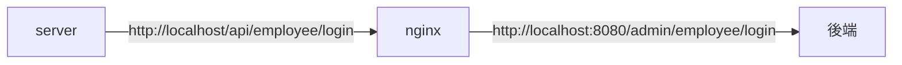
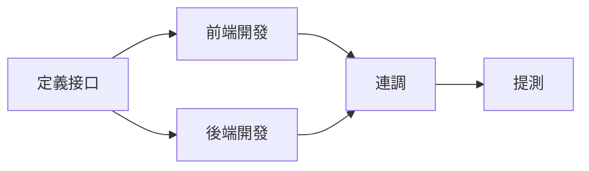

# 蒼穹外賣

## 軟件開發整體介紹

#### 軟件開發流程

1. **需求分析**：需求規格説明書，產品原型

2. **設計**：UI設計，數據庫設計，接口設計

3. **編碼**：項目代碼，單元測試

4. **測試**：測試用例，測試報告

5. 上綫運**維**：軟件環境安裝，配置

#### 角色劃分

1. **項目經理**：對整個項目負責，任務分配，把控進度

2. **產品經理**：進行需求調研，輸出需求調研文檔，產品原型等

3. **UI設計師**：根據產品原型輸出界面效果圖

4. **架構師**：項目整體架構設計，技術選型等

5. **開發工程師**：代碼實現

6. **測試工程師**：編寫測試用例，輸出測試報告

7. **運維工程師**：軟件環境搭建，項目上綫

#### 軟件環境

- **開發環境(development)**：開發人員在開發階段使用的環境，一般外部用戶無法訪問

- **測試環境(testing)**：專門給測試人員使用的環境，用於測試項目，一般外部用戶無法訪問

- **生產環境(production)**：即綫上環境，正式提供對外服務的環境

---


---

## 開發環境搭建

### 前端環境搭建

- 管理端（Web）

day01->前端運行環境->nginx-1.20.2->創建temp文件夾->把nginx放在一個沒有華文目錄下的路徑->啓動nginx.exe

- 用戶端（小程序）

---

### 後端環境搭建

後端工程基於maven進行項目構建，并且進行分模塊開發

- 後端服務（Java）

| 序號  | 名稱           | 説明                                         |
|:---:|:------------:|:------------------------------------------ |
| 1   | sky-take-out | maven父工程，統一管理依賴版本，聚合其他子模塊                  |
| 2   | sky-common   | 子模塊，存放公共類，例如：工具類，常量類，異常類等                  |
| 3   | sky-pojo     | 子模塊，存放實體類，VO，DTO等                          |
| 4   | sky-server   | 子模塊，後端服務，存放配置文件，Controller，Service，Mapper等 |

**sky-pojo**

實體類，VO，DTO

| 名稱     | 説明                             |
| ------ | ------------------------------ |
| Entity | 實體，通常和數據庫中的表對應                 |
| DTO    | 數據傳輸對象，通常用於程序中各層之間傳遞數據         |
| VO     | 視圖對象，為前端展示數據提供的對象              |
| POJO   | 普通JAVA對象，只有屬性和對應的getter和setter |

---

#### 使用Git進行版本控制

- 創建Git本地倉庫

- 創建Git遠程倉庫

- 將本地文件推送到Git遠程倉庫

需要先在terminal輸入maven idea:module 生成 .iml檔案 才開始git init

---

#### 數據庫環境搭建

| 序號  | 表名            | 中文名     |
| --- | ------------- | ------- |
| 1   | employee      | 員工表     |
| 2   | category      | 分類表     |
| 3   | dish          | 菜品表     |
| 4   | dish_flovor   | 菜品口味表   |
| 5   | setmeal       | 套餐表     |
| 6   | setmeat_dish  | 套餐菜品關係表 |
| 7   | user          | 用戶表     |
| 8   | address_book  | 地址表     |
| 9   | shopping_cart | 購物車表    |
| 10  | orders        | 訂單表     |
| 11  | order_detail  | 訂單明細表   |

通過MySQL WORKBRANCH内，登錄賬號，在server内選擇iData import，在設置文件路徑並開始import數據 

---

#### 前後端聯調

- 要把版本換成JDK1才可以正常運行

- 要把端口號8080清空

- 在resource下的.yml文件内，要更改成自己的MySQL的賬號/密碼

nginx反向代理，就是將前端發送的動態請求由nginx轉發到後端服務器

nginx反向代理

- 提高訪問速度

- 進行負載均衡（把大量的請求按照我們指定的方式均衡的分配給集群中的每臺服務器）

- 保證後端服務安全

nginx反向代理的配置方式：

```apacheconf
server{
    listen 80;
    server_name localhost;
    location/api{
        proxy_pass http://localhost:8080/admin/;
    }
}
```



nginx負載均衡的配置方式：


nginx負載均衡策略：

| 名稱         | 説明                             |
| ---------- | ------------------------------ |
| 輪詢         | 默認方式                           |
| weight     | 權重方式，默認為1，權重越高，被分配的客戶端請求就越多    |
| ip_hash    | 依據ip分配方式，這樣每個訪客可以固定訪問一個後端服務    |
| least_conn | 依據最少連接方式，把請求優先分配給連接數少的後端服務     |
| url_hash   | 依據url分配方式，這樣相同的url會被分配到同一個後端服務 |
| fair       | 依據響應時間方式，響應時間短的服務將會被優先分配       |

---

### 完善登錄功能

**問題：** 員工表中的密碼是明文存儲，安全性太低

**方法：**

1. 將密碼加密后存儲，提高安全性

2. 使用MD5加密方式對明文密碼加密

MD5信息摘要算法(Message-Digest Algorithm) ,一種被廣汎使用的密碼散列函數，可以產生一個128位(16字節)的散列值(hash value)，用於確保信息傳輸完整一致。MD5是不可逆的

---

**步驟：**

1. 修改數據庫中明文密碼，改爲MD5加密后的密文

2. 修改Java代碼，前端提交的密碼進行MD5加密后再跟數據庫密碼比對

F9 : 放行（放行到接下來的斷點，然後需要自己手動先取消斷點）

F8 : 單步調試

F7 : 進入到程式内

---

### 導入接口文檔

#### 前後端分離開發流程

- **定制接口**：定義規範

- **前端開發**：mock數據

- **後端開發**：後端自測

- **連調**：校驗格式

- **提測**：自動化測試



---

Yapi

([YApi 接口管理平台](https://hellosean1025.github.io/yapi/)

- 使用Yapi綫上平臺，自行創建賬號並導入接口

---

### Swagger

#### 介紹

使用Swagger，你只需要按照它的規範去定義接口及接口相關的信息，就可以做到生成接口文檔，以及**在綫接口調試頁面**。

**knife4j**：Java MVC框架集成Swagger生成Api文檔的增強解決方案

```xml
<dependency>
    <groupId>com.github.xiaoymin</groupId>
    <artifactId>knife4j-spring-boot-starter</artifactId>
    <version>3.0.2</version>
</denpendency>
```

---

#### 使用方式

1. 導入knife4j的maven坐標

2. 在配置類中加入knife4j相關配置

3. 設置靜態資源映射，否者接口文檔頁面無法訪問

**Swagger 和 Yapi ？**

1. Yapi是設計階段使用的工具，管理和維護接口

2. Swagger在開發階段使用的框架，幫助後端開發人員做後端的接口測試

---

#### 常用注解

通過注解可以控制生成的接口文檔，使檔案文檔擁有更好的可讀性，常用注解如下：

| 注解                | 説明                               |
| ----------------- | -------------------------------- |
| @Api              | 用在類上，例如Controller，表示對類的説明        |
| @ApiModel         | 用在類上，例如entity，DTO，VO             |
| @ApiModelProperty | 用在屬性上，描述屬性信息                     |
| @ApiOperation     | 用在方法上，例如Controller的方法，説明方法的用途，作用 |

---

## 員工管理，j分類管理

### 新增員工

本項目約定：

- 管理端發出的請求，統一使用/admin作爲前綴

- 用戶端發出的請求，統一使用/user作爲前綴

EmployeeController.java

- 使用save函數（新增員工）

EmployeeService.java

- interface

EmployeeServiceImpl.java

- 把輸入的數據進行完善再傳入employeeMapper進行數據庫導入

- employeeDTO -> employee

EmployeeMapper.java

- 數據庫插入

GlobalExceptionHandler.java

- 添加了處理用戶名已存在，抛出異常

**ThreadLocal**

- 並不是一個Thread，而是Thread的局部變量

- 為每個綫程提供單獨一份存儲空間，具有綫程隔離的效果，只有在綫程内才能獲取到對應的值，綫程外則不能訪問。

查詢當前綫程

```java
System.out.println("當前綫程"+Thread.currentThread().getId());
```

ThreadLocal常用方法：

- public void set(T value)：設置當前綫程的綫程局部變量的值

- public T get()：返回當前綫程所對應的綫程局部變量的值

- public void remove()：移除當前綫程的綫程局部變量

JwtTokenAdminInterceptor.java

- 把empid存進行綫程變量

EmployeeServiceImpl.java

- 把變量提取出來，並賦值給createUser.updateUser

---

### 員工分頁查詢

EmployeeController.java

- 定義一個get請求，可以接受數據，並回傳

EmployeeService

- 定義一個pageQuery方法

EmployeeServiceImpl.java

- 編寫pageQuery

- PageHelper插件，可動態幫我們查詢page和pageSize

- 傳給employeeMapper（Page）

- 之後從employeeMapper得到數據后金星完善返回一個pageResult

EmployeeMapper.java

- 定義一個方法（返回值是page）

EmployeeMapper.xml

- 書寫數據庫指令

時間格式問題(202472093522)

解決方法：

1. 在屬性上加入注解，對日期進行格式化

2. 在WebMvcConfiguration中擴展Spring MVC的消息轉換器，統一對日期類型進行格式化處理

WebMvcConfiguration.java

- 擴張消息轉換器

- 引用JacksonObjectMapper内有已經寫好的對象轉換器

---

### 啓用禁用員工賬號

EmployeeController.java

- 定義一個方法，並接受參數及回傳

EmployeeService.java

- 定義一個update方法

EmployeeServiceImpl.java

- 編寫update方法

EmployeeMapper.java

- 定義方法供修改數據庫

- 創建一個實例並傳入EmployeeMapper使用

EmployeeMapper.xml

- 編寫數據庫

---

### 編輯員工

定義兩個模塊

**getById：** 回顯功能

**update**：修改，保存

Controller定義方法接受參數，並最終回傳給server

Service定義方法，並在ServiceImpl内完善數據並傳給Mapper

Mapper内編寫數據庫，或在Mapper.xml内寫

---

### 導入分類模塊功能代碼

**業務規則：**

- 分類名稱必須是唯一的

- 分類按照類型可以分爲菜品分類和套餐分類

- 新添加的分類狀態默認為 ”禁用“

**接口設計：**

- 新增分類

- 分類分頁查詢

- 根據id刪除分類

- 修改分類

- 啓用禁用分類

- 根據類型查詢分類

---

## 菜品管理

### 公共字段自動填充


---

### 新增菜品

---

### 菜品分頁查詢

---

### 刪除菜品

---

### 修改菜品

---
